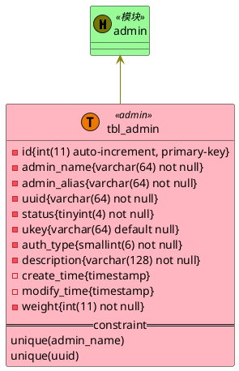

# Blog概要设计

# 运行环境

1. ubuntu
2. Python
3. Apache
4. Mysql
5. Django

# 技术栈

1. 前端： html,css,js
2. 后端： python,django,mysql

# 数据模型

```puml
@startuml
skinparam class {
        ArrowColor Olive

        BackgroundColor PaleGreen
        BackgroundColor<<admin>> LightPink
		BackgroundColor<<user>> Violet
		BackgroundColor<<dept>> LightSkyBlue
		BackgroundColor<<share>> Orange
		BackgroundColor<<group>> Springgreen
		BackgroundColor<<nas>> Gold
		BackgroundColor<<external_link>> Orange
		BackgroundColor<<system>> LightPink
		BackgroundColor<<类型>> Springgreen
}

class admin <<(M, #777700) 模块 >> {

}


class tbl_admin <<(T, #ee7700) admin>> {
        -id{int(11) auto-increment, primary-key}
        -admin_name{varchar(64) not null}
        -admin_alias{varchar(64) not null}
		-uuid{varchar(64) not null}
		-status{tinyint(4) not null}
        -ukey{varchar(64) default null}
		-auth_type{smallint(6) not null}
        -description{varchar(128) not null}
		-create_time{timestamp}
		-modify_time{timestamp}
		-weight{int(11) not null}
		== constraint ==
        unique(admin_name)
		unique(uuid)
}


admin  <-- tbl_admin


@enduml
```